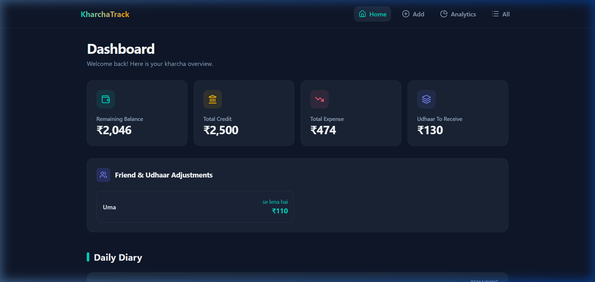
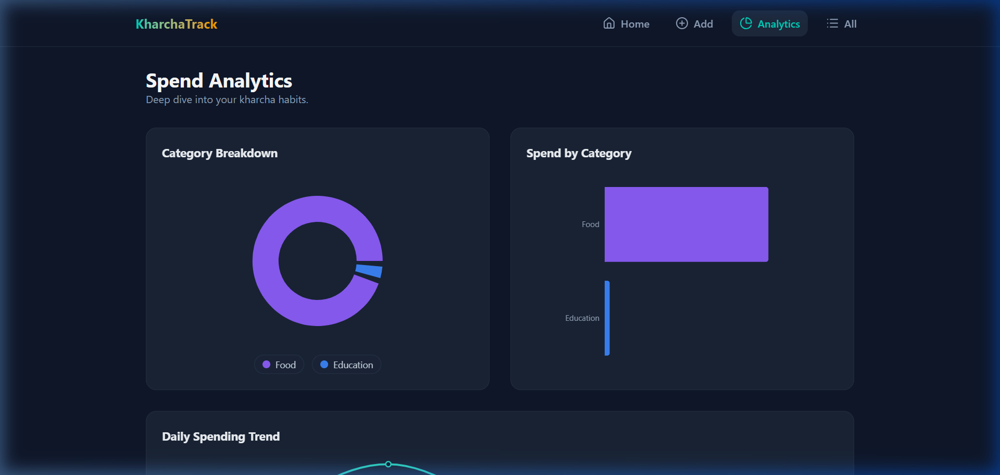
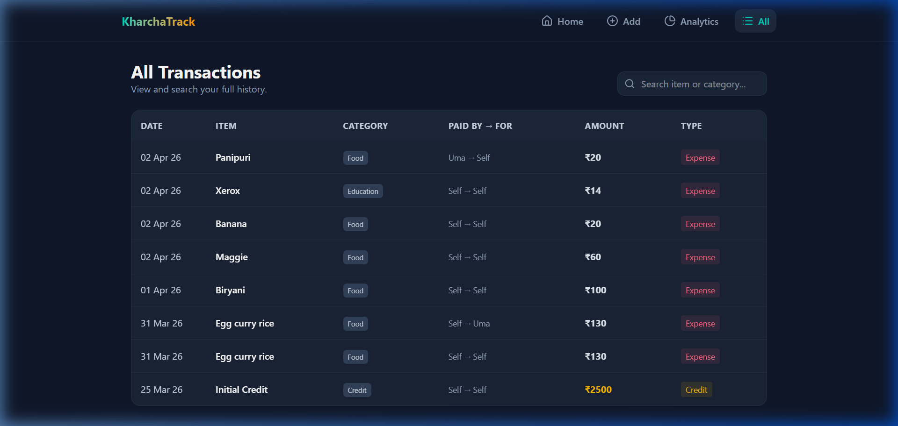

# ₹upiya Budget (formerly KharchaTrack) 💸

[](https://rupiyabudget-bs6ykedtg-shubham-kumar-pandeys-projects-19f09bcd.vercel.app/)
[](#)

A sleek, premium, full-stack personal finance and friend-udhaar tracking application built to ditch the boring accounting-table spreadsheets in favor of a modern diary-style timeline dashboard.

<div align="center">
  
</div>

---

## ✨ Features
- **Auto-Categorization AI**: Type "Biryani" and it instantly categorizes it under *Food*. Type "Netflix" and it falls under *Entertainment*.
- **Udhaar Management**: Accurately tracks when you pay for a friend or they pay for you, calculating net balances seamlessly (e.g., "Uma se lena hai ₹130").
- **Dynamic Timeline Diary**: A beautiful, floating chronological view of your daily expenses showing cascading remaining balances.
- **Detailed Analytics**: Deep dive into your spending habits via responsive Pie, Bar, and Line charts built with **Recharts**.
- **Dark-Navy Aesthetic**: Premium UI with translucent glassmorphism (`backdrop-blur`), soft shadows, and vibrant teal/amber accent colors.

---

## 📸 Screenshots

<div align="center">
  <h3>Deep Dive Analytics</h3>
  

  <br/><br/>
  
  <h3>Transaction History Table</h3>
  
</div>

---

## 🛠️ Tech Stack
- **Frontend**: React (Vite) + Tailwind CSS v4 + Recharts + React Router DOM
- **Backend**: Node.js + Express + Serverless ready
- **Database**: MongoDB Atlas via Mongoose
- **Deployment**: Vercel (Monorepo setup)

## 🚀 Getting Started Locally

### Prerequisites
- Node.js (v18+)
- MongoDB Atlas Connection String (`MONGO_URI`)

### Setup
1. Clone this repository
2. Install dependencies for the backend and frontend:
```bash
cd backend && npm install
cd ../frontend && npm install
```
3. Set your `.env` variables inside the `/backend` folder:
```env
MONGO_URI=mongodb+srv://<username>:<password>@cluster0.exmple.mongodb.net/rupiyabudget
PORT=5000
```
4. Start both servers:
```bash
# In backend/
node index.js

# In frontend/
npm run dev
```

---
*Built with ❤️ utilizing the MERN stack.*
